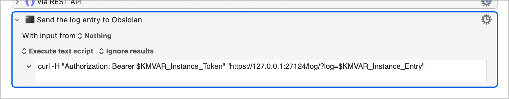

# Personal REST API

An Obsidian plugin that extends the [Local REST API](https://github.com/coddingtonbear/obsidian-local-rest-api) plugin to expose additional endpoints for personal workflows. The plugin focuses on adding a custom endpoint for logging entries to your daily notes.

This plugin is tailored to specific personal needs rather than being a general-purpose community plugin.

## Features

- Adds a `/log` endpoint to the Local REST API
- Automatically adds log entries to your daily notes
- Caches log entries if no daily note exists yet
- Flexible placement options:
  - Find and insert entries under a specific heading by text (e.g., "Activity Log")
  - Automatically create missing headings at configurable positions
  - Support for first/last heading of level or whole file modes
- Customizable log entry format and placement
- Different formats for API-based and manual log entries
- Smart placeholder variables for timestamps
- Provides an Obsidian command with a user-friendly modal for adding log entries manually
- Respects the structure of Markdown documents, preserving blank lines after headers
- Case-insensitive heading matching with automatic punctuation trimming

## Requirements

- [Obsidian](https://obsidian.md/) v0.12.0 or higher
- [Local REST API](https://github.com/coddingtonbear/obsidian-local-rest-api) plugin installed and enabled
- [Daily Notes](https://help.obsidian.md/Plugins/Daily+notes) plugin enabled

## Setup

1. Ensure the Local REST API plugin is installed and active
2. Ensure the Daily Notes plugin is active
3. Install the plugin and activate it
4. Configure your log entry formats and placement preferences in Settings
5. Reload Obsidian if necessary

## API Endpoints

### `GET /log`

URL params:
- `log` - The URL-encoded text that should be appended to the daily note. Can include newlines and markdown.

Example:
```
GET https://localhost:27124/log?log=Your+log+entry+here
```

Make sure to include your API key as specified in the Local REST API plugin settings.

## Manual Entry

The plugin provides an Obsidian command for manual entry:

1. Open the command palette (Ctrl/Cmd + P)
2. Search for "Add log entry"
3. Enter your log entry text in the modal
4. Press Enter or click "Add Entry"

Manual entries use a separate format specified in settings, making it easy to distinguish between API and manual entries.

## Usage with Keyboard Maestro

You can set up a Keyboard Maestro macro that uses a bash command to send data to the endpoint:

```sh
curl -H "Authorization: Bearer $KMVAR_Instance_Token" "https://127.0.0.1:27124/log/?log=$KMVAR_Instance_Entry"
```



## Settings

The plugin provides several customization options:

### Log Entry Formats

- **API Entry Format**: Format for log entries coming from the REST API
- **Manual Entry Format**: Format for log entries added manually via Obsidian

Both formats support the following variables:
- `{entry}` - The actual log entry text (required)
- `{currentTime}` - Current time in 24-hour format (HH:MM)
- `{lastEntryTime}` - Time of the last log entry in 24-hour format (HH:MM)

Example formats:
- `- [x] {currentTime} {entry}`
- `- [x] 📝 {currentTime} {entry} (last entry: {lastEntryTime})`

### Log Entry Placement

The plugin finds a specific heading by text and inserts log entries at the end of that section. If the heading doesn't exist, it will be created automatically at a fallback location.

**Settings:**

- **Heading Level**: The heading level to search for (e.g., `##`, `###`, `####`)
- **Heading Text**: The text of the heading to find
  - Case-insensitive matching (e.g., "Log Items" matches "log items")
  - Punctuation is automatically trimmed (e.g., "Activity Log:" matches "Activity Log")
  - Examples: `Log Items`, `Activity Log`, `Done Today`
- **Fallback Reference**: Where to create the heading if it doesn't exist
  - `First heading of level` - Create before/after the first heading of the specified level
  - `Last heading of level` - Create before/after the last heading of the specified level
  - `File boundary` - Create at the start or end of the file
- **Fallback Position**: Whether to insert `before` or `after` the fallback reference

**How it works:**

1. The plugin searches for a heading matching your specified level and text
   - Example: With level `##` and text `Activity Log`, it finds `## Activity Log` (or `## Activity Log:`)
2. If found, log entries are inserted **at the end of that section**
3. If not found, the heading is created at the fallback location
   - Example: With fallback "Last heading of level" and position "After", it creates the heading after the last `##` in the file

**Example Configuration:**

```
Heading Level: ##
Heading Text: Log Items
Fallback Reference: Last heading of level
Fallback Position: After
```

With this setup:
- Entries go to the end of the `## Log Items` section if it exists
- If the section doesn't exist, it's created after the last `##` heading in the file
- Entries are always added chronologically at the end of the section
